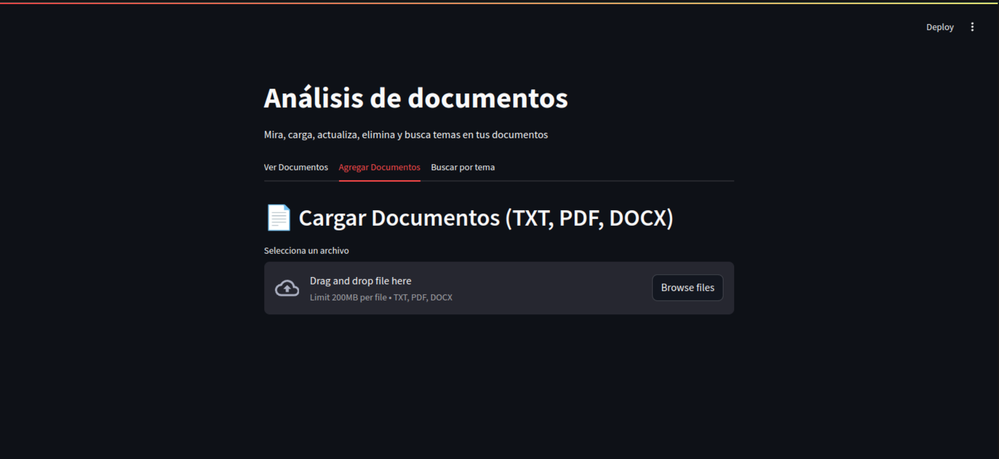
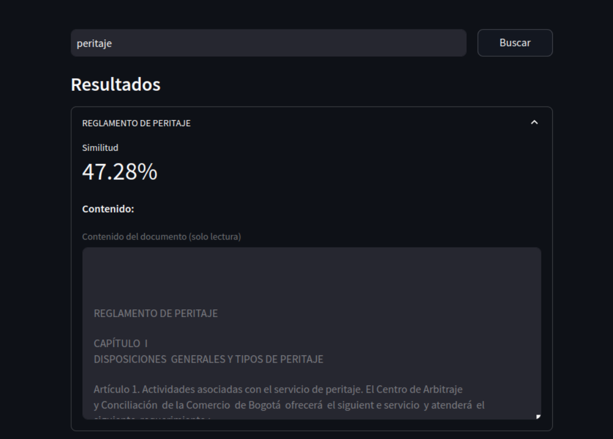

# CRUD con ChromaDB y uso de API con HugginFace

La aplicación permite gestionar documentos con extensión
 `PDF`, `WORD` y `TXT`. Para el desarrollo de la Interfaz
de Usuario se uso `Streamlit` para que fuese lo más 
intuitiva y fácil de usar por el Usuario.

Se usarón modelos **Open-Source** y gratis usando API
de `HugginFace` con el fin de que el aplicativo pueda ser
ejecutado facilmente desde cualquier computadora o
servicio en la nube.

----
----

## Instrucciones de uso

Clona este repositorio con:
```
git clone https://github.com/MontoyaN1/embedding-CRUD.git
```

Ve a la carpeta del proyecto con:

```
cd embedding-CRUD
```

Crea un entorno virutal con Python (Requiere Python 3.10 
o superior):

```
python -m venv  ./
```

Descarga las dependencias necesarias con:
```
pip install -r requeriments.txt
```

Usa tu IDE o editor de texto favorito, en mi caso usare
 `Visual Studio Code` y ve al archivo 
 src/crud_functions.py 

 

 Y coloca tu API de HugginFace en la variable **API_KEY**


Tu Acces Token requiere de mínimo permisos de **Inference** y **Webhooks**


Finalmente ejecuta el aplicativo con:

```
streamlit run ./src/main.py
```
---
---
## Dependencias y requisitos utilizados

Las librerias usadas y que se encuentran en el archivo **requeriments.txt** son:

+ chromadb
+ streamlit
+ PyPDF2
+ python-docx
+ sentence-transformers
+ SentencePiece
+ torch
+ numpy
+ uuid
+ requests
+ logging

Pese a que no se ejecutan modelos en local, se requiere tener dependencias como `Cmake`, `gcc` y `c++`. En caso de no tenerlas puedes instarlas con:

### Windows
Instala desde las páginas principales de [Cmake](https://cmake.org/download/), [gcc](https://gcc.gnu.org/install/binaries.html) y [C++](https://visualstudio.microsoft.com/es/vs/features/cplusplus/)

### Linux 🐧 

**Base Debian**:

```shell
sudo apt install cmake build-essential #incluye gcc y c++
```

**Base Fedora/RHEL**:

```shell
sudo dnf install cmake gcc-c++
```

**Base Arch Linux**:

```shell
sudo pacman -S cmake base-devel #incluye gcc y c++
```

**Sistemas con gestor o repositorio de Nix como NixOs**:

```shell
nix-env -iA nixpkgs.cmake nixpkgs.gcc nixpkgs.gnumake
```

Desde el archivo `/etc/nixos/configuration.nix` sería:

```nix
environment.systemPackages = with pkgs; [
  gcc
  gnumake
  cmake
];
```
---
---

## Ejecución y ejemplos de uso

Una vez ejecutado el aplicativo se abrira una ventana en el navegador como la siguiente:


La aplicación cuenta con tres pestañas en donde se pueden ver los documentos, cargar documentos y buscar temas presentes en los documentos.

Lo primero será cargar un nuevo documento en donde las extensiones validas son `PDF`, `WORD` y `TXT`. 



Damos click en el boton de subir documentos:


Buscamos el documento con extensión valida:


Se cargara el documento en donde podremos ver una vista prevía del texto extraido:


Ahora a cargar el documento dando click en el respectivo boton:


Esperar que el documento sea analizado por el modelo para generar el `embedding` y una descripción del documento como `metadato`


Ahora tendremos una columna que muestra el total de documentos cargados y el promedio de carácteres de los documentos:


Y se puede ver el contenido del documento con la descripción generada por el modelo `deepseek-ai/DeepSeek-R1-Distill-Qwen-32B`:


Abajo del contenido del documento se puede eliminar y editar el documento:


Ahora probemos busqueda de temas en los documentos, para ello cargaremos más documentos:


En la pestaña habra una barra de busqueda en donde colocaremos palabras claves o temas que estén presentes en nuestros documentos:


Una vez digitado el tema solo es presionare ENTER o dar click en buscar en donde se arrojarán los documentos con una similitud superior al 15 %:




---
---

## Consideraciones

La aplicación usa modelos de LLM por medio de `API` proporcionadas por HugginFace en donde se puede destacar los siguientes aspectos:

### Ventajas:

+ Ejecución rápida del proyecto, no hay que esperar a que se inicialice o cree un modelo en local.
+ Ejecución en cualquier Hardware, con solo tener una buena conexión a intenet es suficiente para correr la aplicación sin complicaciones.
+ Tiempos de respuestas relativamentes rápidos.

### Desventajas:
+ Dependencia de los servidores de HugginFace, si los servidores están saturados la aplicación no puede ser utilizada complementamente.
+ Respuestas incoherentes o extrañas, dado la baja prioridad que tiene los API KEY gratiutas de HugginFace el algunas ocaciones los modelos darán respuestas no esperadas.

Hay que considerar los aspectos positivos y negativos de usar API para modelos y ejecutar el modelo en local, dicha decisión dependerera del enfoque, requerimientos, presupuesto y escalabilidad que se le quiere dar al proyecto.

---
---

## Modelos usados

Se usa a [deepseek-ai/DeepSeek-R1-Distill-Qwen-32B](https://huggingface.co/deepseek-ai/DeepSeek-R1-Distill-Qwen-32B) para le generación de la descripción o resumen de cada documento. Se escogió dicho modelo dado la ventaja de las respuesta en comparación a otros modelo al ser capaz de razonar y dar respuestas en la mayoría de casos más certeras. En general puedo decir este modelo da mejores respuestas en documentos en español que en otros idiomas como se ve en la siguientes imágenes:


Para transformar los textos extraidos de los textos en embeddings que pueda usar `ChromaDB` se usa a [sentence-transformers/all-MiniLM-L6-v2](https://huggingface.co/sentence-transformers/all-MiniLM-L6-v2).
Dicha transformación se usa tanto con los documentos y con los temas o palabras claves buscadas. No tuve ningún inconveniente con el modelo y los valore que arrojaba de cada documento.

## Flujo de trabajo

La idea principal con la que se moldeo la aplicación se puede resumir en el siguiente diagrama de flujo:


## Experiencia de desarrollo

La creación de la aplicación desde la idea básica hasta la interfaz de usuario fuerón un reto como programador, personalmente creo que no estaba inicialmente en la capacidad de construir la aplicación dada mi poca experiencia y conocimiento en Python ya que solo tengo como referencia lenguajes de programación como JAVA y PHP en donde mi mayor reto fue encontrar similitudes entre estos lenguajes y Python. 

Pude darme cuenta mientras desarrollaba la aplicación el porqué Python es el lenguaje más popular hasta el momento, es muy versatil y con demasiadas librerias que permiten combinar facilmente diferentes proyectos en uno solo sin tener que cambia de lenguaje de programación. 

Al comienzo no terminaba de entender como sería plasmar el flujo de la aplicación pero dada las características anteriormente mencionadas de Python se me fue haciendo más entendible, y diría que fácil, el cómo iba crear la aplicación.

Otro de los errores o retos que tuve fue en hayar un modelo que me diera respuestas correctas o que por lo menos fueran coherentes con el documento dado. Estuve un buen rato probando modelos y luego de dar con `deepseek-ai/DeepSeek-R1-Distill-Qwen-32B` que me dio respuestas muy buenas, ahora era de jugar con los parametros como la temperatura, promts y roles para que el modelo me diera aun mejores descripciones de las obtenidas incialmente. 

Finalmente, puedo decir que el desarrollo del proyecto fue muy interesante, soy de los que piensa que se aprende haciendo y equivocandose, siento que me equivoque muchisimo pero al final de tantos intentos por fin di con una aplicación de la que puedo sentirme orgulloso. No niego que pueda ser mejor, ya que es obvio que lo puede ser, pero creo que para ser uno de mis primera aplicaciones medianamentes complejes cumple las expectativas y requerimientos dados. Ojala que la aplicación y toda esta explicación puedan serte de ayuda en algún proyecto.

